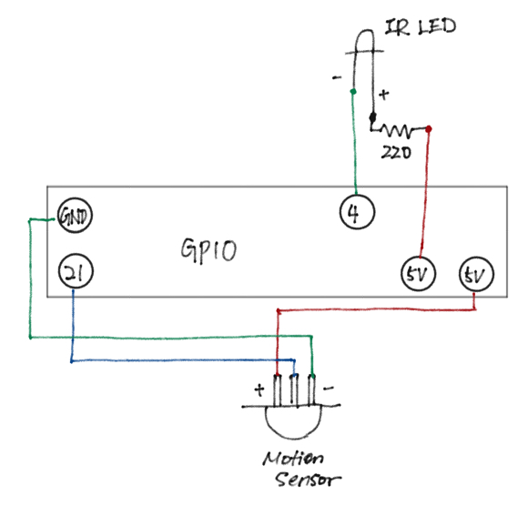

# Building the nest box and python code

We considered purchasing a bird nest box, but frankly they were too expensive and/or had issues with installing raspi and the apparatus. So we headed to Home Depot to get some materials.

### (1) Purchasing materials
We bought the following items at a local Home Depot store:
 - One pressure-treated wood board (1.25 inches thich, 4 inches wide, 8 ft long)
 - Hinge (two pack)
 - Wood stain

We purchased the pressure-treated (PT) wood thinking that it will have a good chance of withstanding the weather damages. However, later we learned that birds prefer natural wood so the PT wood was not the best choice after all. Oh well -- we at least dried the wood under the direct sunlight as much as we can.

Anyhow, the construction begun on Marchh 14, 2021.

### (2) Cutting the board into parts

All components were cut out from a single PT 8-foot board using a handsaw. No power tools here! We did use the power drill to drill the nails, however.

 

### (3) Sanding the surfaces

We used the 2-inches diameter power saw to make the entrance. Need to sand the interior smooth so that birds don't get stuck!

 

### (4) Wiring the electronic components

We bought:
 - A kit containing Raspberry Pie Zero W, a case, and NoIR camera.
 - GPIO Hammer Headers
 - Camera board case
 - IR LED bulbs

We also used the motion sensor unit we bought for the IoT Workshop (as part of a starter kit). The picture below shows how these components were wired during our experiment.

 

We referenced "The Official Raspberry Pi Camera Guide" by Raspberry Pi Press (ISBN 978-1-912047-52-9) Chapter 14 "Install a bird box camera" for wiring IR LED to RPi. We also adjusted the camera focus.

### (5) Python coding

We wrote the Python code mostly by combining the relevant codes from the IoT Workshop. Features we included in the code were:
 - Motion sensor triggers the camera and IR LED.
 - NoIR camera takes a 30-second video.
 - Upload the video file to Kintone App.
 - Remove video files temporarily stored on RPi.

A small portion of the code to control the IR LED was taken from the tutorial material that came with the starter kit.

### Putting all together

Finally, we put all the components to the bird nest box. This is how it looks like (less the plastic cover to be installed for weathering).

We went "creative" to avoid soldering. A small breadboard and masking tapes were used to wire the electronic components.

Jump wires were taped firmily to the structure so that the connection will not easily come off from both the RPi and the breadboard.

The box was installed just outside of the house and near the shrubs. This location is just outside of the room that has a wifi router.

And we will wait hoping that someone (or rather "somebird") will like the box and actually nest in it.
